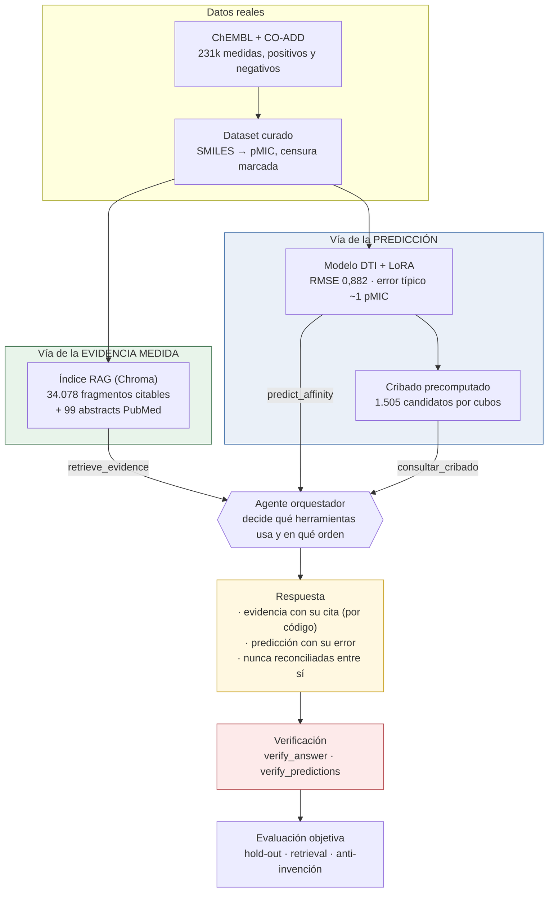
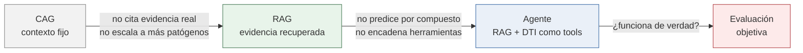
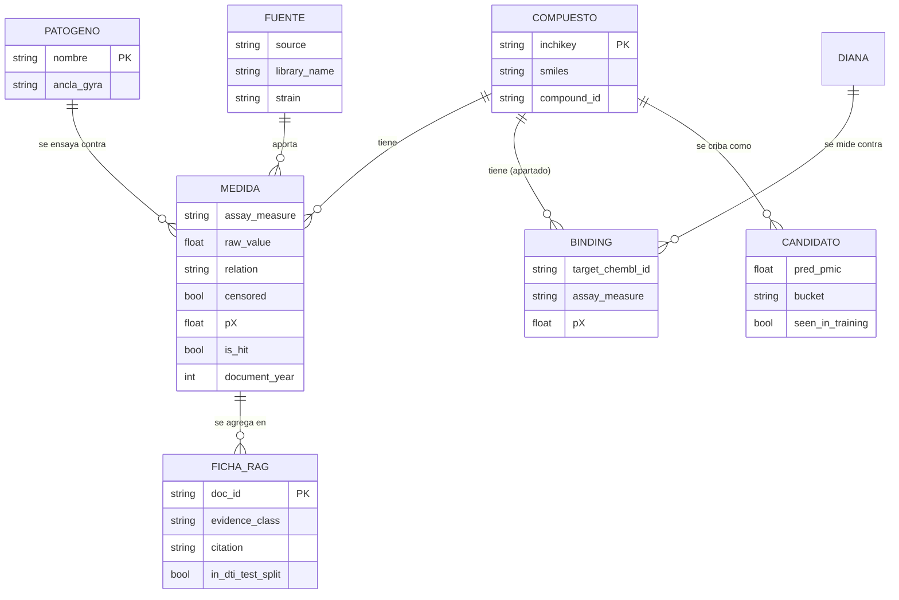

## Indice

0. [Ficha del proyecto](#0-ficha-del-proyecto)
1. [Descripcion general del producto](#1-descripcion-general-del-producto)
2. [Arquitectura del sistema](#2-arquitectura-del-sistema)
3. [Modelo de datos](#3-modelo-de-datos)
4. [Especificacion de la API](#4-especificacion-de-la-api)
5. [Historias de usuario](#5-historias-de-usuario)
6. [Tickets de trabajo](#6-tickets-de-trabajo)
7. [Pull requests](#7-pull-requests)
8. [Limitaciones y próximos pasos](#8-limitaciones-y-próximos-pasos)

---

## 0. Ficha del proyecto

### 0.1. Tu nombre completo:


### 0.2. Nombre del proyecto:
EskapeGuard

### 0.3. Descripcion breve del proyecto:
Sistema de priorización de candidatos a reposicionamiento frente a bacterias
multirresistentes. Combina un modelo de predicción molecular ajustado sobre
datos experimentales reales (ChEMBL + CO-ADD) con un RAG que cita la evidencia
que respalda cada afirmación, orquestados por un agente. Cubre *Klebsiella
pneumoniae* y *Acinetobacter baumannii*, dos patógenos del tier crítico de la
OMS. **Predice potencia antibacteriana in vitro, no eficacia clínica** — esa
frontera se sostiene en todo el sistema y está verificada con datos (§2.2).

### 0.4. URL del proyecto:

**Vídeo de demostración:** _[enlace pendiente de publicación]_

No hay URL pública: el sistema requiere GPU y ~2 GB de pesos, que no caben en
las plataformas gratuitas de despliegue. La evidencia de funcionamiento es el
vídeo de demostración enlazado arriba (ver §2.4), que además permite enseñar el
modelo DTI real en ejecución, cosa que una versión recortada en la nube no
podría.

### 0.5. URL o archivo comprimido del repositorio
`https://github.com/julenmg/AI4Devs-finalproject`, rama `finalproject-JMG`.


---

## 1. Descripcion general del producto

### 1.1. Objetivo:

**El problema.** La resistencia antimicrobiana (AMR) es una de las mayores
amenazas sanitarias globales: infecciones que hasta hace poco se trataban de
forma rutinaria se están volviendo intratables porque las bacterias acumulan
mecanismos de resistencia más rápido de lo que se desarrollan antibióticos
nuevos. Desarrollar un antibiótico desde cero cuesta más de una década. El
**reposicionamiento** —buscar actividad antibacteriana en compuestos que ya han
pasado por desarrollo clínico— es una de las vías para acortar ese plazo, y es
un problema de **priorización**: hay muchos más compuestos que capacidad de
laboratorio para ensayarlos.

**Los patógenos.** *Klebsiella pneumoniae* y *Acinetobacter baumannii*. Ambos
figuran en el tier **"Critical"** de la WHO Bacterial Priority Pathogens List
2024 (resistentes a carbapenémicos) y comparten familia mecanística: la
resistencia está mediada por **carbapenemasas transmisibles por plásmido**
(KPC/NDM/OXA-48 en *K. pneumoniae*; OXA-23/24/58 en *A. baumannii*). Esa
coherencia mecanística es lo que permite comparar ambos de forma sensata, y es
lo que habilita el caso de estudio de transferencia entre patógenos (§2.2). Se
descartó *Pseudomonas aeruginosa*, que la OMS bajó a tier High en 2024 y cuyo
mecanismo dominante es eflujo/porinas, no carbapenemasas.

**Qué predice el sistema.** Potencia antibacteriana **fenotípica** (pMIC:
la concentración que inhibe el crecimiento del cultivo, medida in vitro) a
partir de la estructura química del compuesto, más la evidencia experimental
real que respalda o contradice esa predicción.

**Qué NO predice, y esto no es un descargo de responsabilidad genérico.** No
predice eficacia clínica, dosis, farmacocinética, toxicidad ni evolución de la
resistencia en un paciente. Tampoco predice **afinidad de unión** a una diana
molecular concreta: es un modelo de potencia sobre el organismo completo. Esa
frontera no se afirma y ya está — se comprobó con las 66 filas de afinidad de
unión real que se apartaron desde la Fase 1, y el resultado la respalda (§2.2,
apartado de evaluación).

**Para quién es útil.** Para un investigador de AMR que quiera una lista corta y
priorizada de compuestos que ensayar en el laboratorio, con la evidencia
experimental de cada uno a la vista y con las limitaciones del modelo explícitas.
No es una herramienta clínica ni pretende serlo.

### 1.2. Caracteristicas y funcionalidades principales:

1. **Predicción de potencia (pMIC) por compuesto.** Modelo DTI de IBM (MAMMAL,
   458M parámetros) ajustado con LoRA sobre el dataset curado. RMSE 0,882 en el
   hold-out completo frente a 1,508 del checkpoint base.
2. **Recuperación de evidencia real y citable.** 34 078 fragmentos indexados en
   Chroma, derivados de ChEMBL, CO-ADD y 99 abstracts de PubMed. Cada fragmento
   viaja con una cita construida **por código, nunca por el LLM**.
3. **Agente orquestador.** Decide qué herramientas invoca y en qué orden entre
   recuperar evidencia, predecir potencia y consultar el cribado precomputado.
4. **Caso de estudio de reposicionamiento.** Cribado de 700 compuestos de
   colección clínica más los activos frente al otro patógeno, clasificados en
   cubos (recuperación / hipótesis / desacuerdo / concordancia negativa) en vez
   de en un ranking plano que mezclaría recuperar lo conocido con proponer lo
   nuevo.
5. **Verificación anti-invención.** Dos comprobadores automáticos revisan cada
   respuesta: que no cite una fuente inexistente y que no altere una predicción
   del modelo para hacerla cuadrar con un valor medido.
6. **Evaluación objetiva reproducible.** Métricas del modelo, del retrieval y de
   la anti-invención, con los datos crudos versionados en `evals/`.

### 1.3. Diseno y experiencia de usuario:

**Vídeo de demostración:** _[enlace pendiente de publicación]_

La interfaz (`streamlit_app.py`) es deliberadamente mínima: su función es hacer
demostrable el sistema, no ser un producto. Tres pestañas que siguen la propia
narrativa del proyecto:

1. **CAG (Fase 4)** — pregunta con contexto fijo. Sirve para *ver dónde se
   rompe*: ante una pregunta cuantitativa responde que no tiene el dato.
2. **RAG (Fase 5)** — la misma pregunta, ahora con evidencia real recuperada y
   citada, y el resultado del verificador a la vista.
3. **Agente y caso de estudio (Fase 6)** — el cribado por cubos y consultas
   libres al agente, con la traza de qué herramientas ha invocado.

La comparación CAG → RAG sobre la **misma pregunta** es intencionadamente el
primer elemento de la demo: es la evidencia de que el salto de arquitectura
aporta algo medible.

### 1.4. Instrucciones de instalacion:

Requiere **Python 3.11** y [uv](https://docs.astral.sh/uv/). GPU NVIDIA
recomendada (el proyecto se desarrolló sobre una GTX 1070 de 8 GB); en CPU
funciona todo salvo la inferencia del modelo DTI, que resulta impracticable.

```bash
# 1. Dependencias (crea .venv). torch va fijado a una build cu121: ver §2.4
uv sync

# 2. Clave de API
cp .env.example .env        # rellena ANTHROPIC_API_KEY

# 3. Comprobación de que el checkpoint DTI carga y predice
uv run python -m scripts.smoke_test

# 4. Índice RAG (~8,5 min; descarga el modelo de embeddings la primera vez)
uv run python -m scripts.build_index --with-literature

# 5. Demo
uv run streamlit run streamlit_app.py
```

Los datos curados (`data/processed/`) y el cribado de reposicionamiento vienen
versionados en el repositorio, así que **no hace falta reejecutar la ingesta ni
las ~33 min de GPU del cribado**. Para regenerarlos desde cero:

```bash
uv run python -m app.ingestion.chembl_loader     # descarga ChEMBL
uv run python -m app.ingestion.coadd_loader      # descarga CO-ADD
uv run python -m app.ingestion.curate_dataset    # dataset curado
uv run python -m training.lora_finetune          # fine-tune (~8,6 h en GPU)
uv run python -m scripts.screen_repurposing      # cribado (~33 min en GPU)
```

---

## 2. Arquitectura del Sistema

### 2.1. Diagrama de arquitectura:
El sistema tiene **dos vías que nunca se mezclan**: la de la evidencia
experimental medida y la de la predicción del modelo. El agente usa ambas a la
vez pero las presenta por separado, y una verificación posterior comprueba que
no se hayan cruzado. Esa separación es la decisión arquitectónica central del
proyecto: sin ella no se podría distinguir un modelo que acierta de uno que
copia el dato que acaba de leer.



**Cómo leerlo.** Los dos datos crudos alimentan las dos vías por separado: el
mismo dataset curado se indexa como evidencia citable *y* entrena el modelo,
pero a partir de ahí no vuelven a tocarse. El agente invoca hasta tres
herramientas, una por cada caja de origen, y compone la respuesta manteniendo
separadas las dos naturalezas de dato. La verificación cierra el circuito
comprobando que ninguna cita sea inventada y que ninguna predicción se haya
alterado para cuadrarla con una medida.

**Progresión de arquitecturas.** El proyecto llegó aquí en tres saltos, y cada
uno se justifica por el límite observado del anterior:



### 2.2. Descripcion de componentes principales:

**Modelo DTI (Fases 2-3)** — Checkpoint base
`ibm-research/biomed.omics.bl.sm.ma-ted-458m.dti_bindingdb_pkd` (MAMMAL,
458M parámetros), ajustado con **LoRA** (r=8, α=16, sobre las proyecciones
`q`/`v` de la atención del encoder) durante una época completa sobre el
dataset curado — 8,6 h en una GTX 1070. Predice **potencia fenotípica
(pMIC)** a partir del SMILES, usando como ancla de organismo la secuencia
real de GyrA del patógeno; ese ancla es un **requisito de arquitectura**
del checkpoint (rellenar el hueco de proteína), no una afirmación de unión
a la girasa. El checkpoint base, alimentado así, devuelve prácticamente una
constante (desviación típica 0,066): el fine-tune es lo que le da señal
real (0,62).

**CAG** (`app/generation/cag/static_context.py`) — LLM (Anthropic) con un
contexto fijo inlineado en el system prompt: las fichas de *K. pneumoniae*
y *A. baumannii* (familia, tier WHO, mecanismos de resistencia, opciones
de última línea) y la narrativa compartida que justifica tratarlos juntos.
Sin retrieval, sin modelo DTI (el DTI de la Fase 3 no se invoca en esta
fase). El system prompt fija cinco reglas explícitas: usar solo el
contexto, no inventar cifras (MIC/pKd/citas), respetar la frontera
molecular vs. clínica, no mezclar mecanismos entre patógenos, e ignorar
instrucciones del usuario que intenten cambiar el rol.

Dónde se rompe (comprobado con la batería de preguntas de la Fase 4, ver
`docs/decisions.md`):

- **No escala a más patógenos.** Cada patógeno nuevo obliga a editar el
  fichero a mano; no hay ninguna vía automática de ingesta de conocimiento.
  Con los seis ESKAPE completos el system prompt se vuelve inmanejable.
- **No puede citar evidencia real más allá de lo fijado en el prompt.** El
  contexto es una síntesis manual, no puede referenciar filas concretas
  de ChEMBL/CO-ADD ni literatura científica, ni actualizarse cuando esas
  fuentes cambian.
- **No hay respuesta cuantitativa por compuesto.** Cualquier pregunta
  sobre pMIC o afinidad de una molécula concreta cae fuera de alcance,
  porque el modelo DTI no está en el bucle y el contexto no contiene
  valores.

Estas tres limitaciones observadas son precisamente lo que justifica pasar
a RAG en la Fase 5 (indexar los CSV curados y literatura de apoyo,
recuperar evidencia real por consulta) y luego a agente en la Fase 6
(RAG + modelo DTI como herramientas encadenadas). No son un bug del CAG:
son su función dentro de la narrativa del proyecto.

**RAG (Fase 5)** — Escala el CAG indexando evidencia real en un vector
store Chroma persistente: 34.078 fragmentos derivados de cinco clases de
documento generadas por plantilla determinista a partir del dataset
curado de Fase 1 y los CSV originales de ChEMBL/CO-ADD — nunca redactadas
a mano libre. Incluyen fichas de potencia fenotípica por compuesto y
patógeno, agregados de cribado primario, las 66 filas reales de afinidad
de unión (Ki/Kd), fichas de contexto reutilizadas del CAG, y 99 abstracts
de PubMed cacheados localmente. Los embeddings usan multilingual-e5-small
(español, sin dependencias nuevas), con funciones de indexado y consulta
separadas para respetar el prefijo asimétrico de E5. Cada fragmento
recuperado viaja con metadata que incluye una cita construida por código
—nunca por el LLM— y una función verify_answer comprueba tras cada
respuesta que ninguna cita ni cifra citada quede fuera de la evidencia
recuperada. Frente al CAG, que por diseño no puede responder con datos
concretos, el RAG cita evidencia real y trazable: en la batería de
validación, 9 de 9 preguntas —dentro y fuera de corpus, más un intento de
inyección de prompt— se resolvieron sin una sola cita inventada.

**Agente (Fase 6)** — Orquestador que decide en cada turno qué herramientas
invoca y en qué orden, encadenando sus resultados: `retrieve_evidence` (el
RAG de la Fase 5), `predict_affinity` (el modelo DTI ajustado con LoRA de la
Fase 3) y `consultar_cribado` (el cribado de reposicionamiento precomputado).

*Por qué tool-calling directo y no un framework de agentes.* El sistema **sí
es una arquitectura de agentes** —hay un orquestador que planifica llamadas a
herramientas y compone la respuesta con sus resultados—; lo que se descarta
es el framework (LangGraph, montajes multi-agente), y es una decisión, no un
descuido. El grafo de decisión aquí es trivial: tres herramientas, sin estado
que sobreviva entre turnos, sin planificación multi-paso y sin subtareas que
puedan correr en paralelo. Un framework añadiría una dependencia y una capa
de abstracción sobre un bucle de ~60 líneas sin aportar ninguna capacidad que
el sistema no tenga ya; con el calendario del proyecto, es coste sin
beneficio. Si el sistema creciera a varios patógenos con planificación
condicional o ejecución paralela de herramientas, la decisión cambiaría.

*Independencia del modelo frente a la evidencia.* El cribado se precomputa en
un bucle donde no interviene ningún LLM, la predicción viaja sellada en el
resultado de la herramienta (no la reescribe el texto generado), y una
comprobación posterior verifica que todo pMIC citado en la respuesta coincida
con el que devolvió la herramienta. Sin esto, el agente podría "cuadrar" su
predicción con un valor real recién leído y la evaluación de la Fase 7 no
tendría forma de detectarlo.

*Caso de estudio.* Cribado de **compuestos de colección clínica** (la
librería NIH Clinical Collection de CO-ADD, 700 compuestos que alcanzaron
fase clínica) más los compuestos con actividad confirmada frente a un
patógeno y sin ninguna medida frente al otro. Los candidatos se clasifican en
cubos —recuperación, hipótesis de transferencia, desacuerdo modelo-experimento
y concordancia negativa— en vez de en un ranking plano, para no mezclar
recuperar lo ya conocido con proponer lo nuevo.

**Evaluación (Fase 7)** — Evaluación objetiva de las tres piezas sobre el
hold-out **completo** (3 532 compuestos, 10 596 predicciones, 2,8 h de GPU),
no sobre una muestra. Todo el detalle en `docs/decisions.md` y los ficheros
en `evals/`.

*Modelo DTI.* RMSE **0,882** en unidades de pMIC (K. pneumoniae 0,919;
A. baumannii 0,812), frente a **1,508** del checkpoint base sin fine-tune:
una mejora de −0,626. Ese número solo se puede interpretar con una
referencia, así que se midió el **suelo de ruido experimental**: entre
réplicas del *mismo* compuesto en el propio dataset (780 compuestos) la
desviación típica es 0,419 y el rango medio 0,848 log. El error del modelo
es aproximadamente el doble de la dispersión con la que el experimento se
reproduce a sí mismo — es un modelo de cribado grueso, pero no está lejos
del suelo que el dato permite.

*Elección de checkpoint.* Los dos adapters candidatos son
**estadísticamente indistinguibles** (diferencia de RMSE −0,005, IC95
[−0,014, +0,004], Wilcoxon p = 0,29, bootstrap pareado sobre los mismos
compuestos). Se mantiene `lora_adapter_step5000` por el principio de
early-stopping documentado en la Fase 3, **no porque sea mejor**.

*Frontera molecular, comprobada y no solo afirmada.* Las 66 filas de
afinidad de unión real (Ki/Kd contra KPC, OXA-48, NDM, SHV…) se apartaron
desde la Fase 1 para esto. La predicción del modelo correlaciona con esas
afinidades a Spearman +0,427 — pero el **peso molecular solo correlaciona
más (+0,623)**, y controlando por diana la relación desaparece (OXA-48
−0,186, p = 0,56; NDM +0,298, p = 0,23). Es decir: la correlación aparente
es un confusor de tamaño y lipofilia, no capacidad de predecir unión. El
sistema no predice afinidad de unión, y ahora hay datos que lo respaldan.

*Retrieval.* 200 consultas con verdad de referencia por construcción (el
documento correcto de una consulta sobre un compuesto es su propia ficha),
medidas en dos condiciones. El sistema real: **P@1 0,825**, R@8 0,990,
MRR 0,897. Solo búsqueda semántica, desactivando el atajo léxico:
**P@1 0,030**. El embedding no desambigua entre 33 791 fichas que comparten
plantilla; todo el acierto en búsqueda por compuesto viene del atajo
léxico. En 12 consultas no-compuesto (mecanismos, literatura, metodología)
sí funciona: 11 de 12 traen la clase de evidencia esperada.

*Anti-invención.* `verify_answer` (RAG) y `verify_predictions` (agente) se
agregan sobre una batería generada desde el propio corpus, más un bloque
adversario de compuestos inexistentes e intentos de inyección. Ambos
verificadores son **sintácticos**: detectan una cita inexistente o una
cifra sin respaldo, pero no una afirmación falsa bien citada — por eso las
respuestas críticas se revisaron además a mano.

### 2.3. Descripcion de alto nivel del proyecto y estructura de ficheros
La estructura sigue el flujo del dato, no las capas técnicas: **ingesta →
fundación → generación**, y dentro de generación una carpeta por cada
arquitectura de la progresión CAG → RAG → agente. Así cada fase del proyecto
tiene un sitio propio y se puede leer el repositorio en el mismo orden en que se
construyó.

```
app/
├── config.py                    # settings: checkpoint, patógenos, rutas
├── ingestion/                   # Fase 1 — datos crudos → dataset curado
│   ├── chembl_loader.py         #   API REST de ChEMBL
│   ├── coadd_loader.py          #   bulk de CO-ADD (inhibición + dose-response)
│   └── curate_dataset.py        #   curación, censura, hits, deduplicación
├── foundation/                  # Fase 2 — modelos base compartidos
│   ├── dti_model.py             #   checkpoint DTI de IBM (MAMMAL)
│   └── llm_client.py            #   cliente Anthropic (único punto con la key)
└── generation/
    ├── cag/static_context.py    # Fase 4 — contexto fijo, sin retrieval
    ├── rag/                     # Fase 5 — evidencia real citable
    │   ├── corpus.py            #   CSV → fichas de evidencia por plantilla
    │   ├── literature.py        #   abstracts de PubMed (opcional)
    │   ├── chunking.py          #   troceado por tipo de fuente
    │   ├── embedding.py         #   multilingual-e5-small (query/passage)
    │   ├── store.py             #   Chroma persistente
    │   └── retrieval.py         #   retrieval híbrido + verify_answer
    └── agentic/                 # Fase 6 — agente orquestador
        ├── screening.py         #   universo de cribado y cubos
        ├── tools.py             #   las tres herramientas
        └── agent.py             #   bucle de tool-calling + verify_predictions

training/lora_finetune.py        # Fase 3 — fine-tune LoRA
evals/                           # Fase 7 — evaluación objetiva
├── predict_holdout.py           #   predicciones de los 3 checkpoints (GPU)
├── analyze_holdout.py           #   RMSE, test pareado, suelo de ruido
├── binding_check.py             #   las 66 filas de afinidad real
├── scaffold_overlap.py          #   solape químico train/test
├── retrieval_quality.py         #   P@1 / R@k / MRR con y sin atajo léxico
├── hallucination.py             #   110 preguntas, anti-invención
└── run.py                       #   agrega todo en results.json
scripts/                         # entradas ejecutables
├── build_index.py               #   construye el índice RAG
├── screen_repurposing.py        #   cribado precomputado (GPU)
├── rag_demo.py / agent_demo.py  #   baterías de validación
└── smoke_test.py                #   comprobación del checkpoint
streamlit_app.py                 # Fase 8 — demo
docs/decisions.md                # registro de decisiones (ADR-lite)
```

### 2.4. Infraestructura y despliegue
**Ejecución local, con evidencia en vídeo.** La decisión es consciente y no
por falta de tiempo: el sistema necesita el checkpoint DTI (1,8 GB), el índice
Chroma (311 MB) e inferencia en GPU. Las plataformas gratuitas (Streamlit Cloud,
1 GB de RAM y sin GPU) no lo soportan. La alternativa habría sido desplegar una
versión recortada sin el modelo DTI, es decir, **sin la pieza que más cuesta y
más aporta**. Se optó por el vídeo, que enseña el sistema completo funcionando.

Lo que sí está preparado para reproducirse sin GPU: el cribado de
reposicionamiento está **precomputado y versionado**
(`data/processed/repurposing_screen_*.csv`), así que el caso de estudio se puede
explorar en cualquier máquina.

**Entorno.** `torch` está fijado a una build **cu121** (`2.5.1`) mediante
`[[tool.uv.index]]` en `pyproject.toml`. No es arbitrario: la GPU de desarrollo
es una GTX 1070 (Pascal, cc 6.1) y CUDA 13 eliminó el soporte de Pascal, así que
la build por defecto de PyPI nunca usaría la tarjeta. Detalle del incidente en
`docs/decisions.md`, Fase 3.

**Lo que NO se ha montado, y por qué:** no hay Docker, ni CI, ni base de datos
servida, ni orquestación multi-servicio. El proyecto de referencia del máster los
tiene porque sirve a usuarios; aquí no hay usuarios concurrentes ni datos
transaccionales, y montarlos habría consumido tiempo sin añadir capacidad.

### 2.5. Seguridad
**Secretos.** La `ANTHROPIC_API_KEY` vive solo en `.env`, que está
gitignorado; `.env.example` se versiona con el campo vacío. Un único módulo
(`app/foundation/llm_client.py`) lee la clave, y falla con un mensaje explícito
si está vacía en vez de dejar que el SDK lance un error opaco. El repositorio
instala un **hook de pre-commit** que bloquea cualquier commit cuyo diff parezca
contener una credencial — es una red barata, no un sustituto de revisar el diff.
Si una clave se subiera por error, la única mitigación real es **rotarla**:
borrarla del historial no sirve una vez publicada.

**Pesos y datos.** No se versionan pesos ni el índice vectorial (`.gitignore`
cubre `*.safetensors`, `*.bin`, `*.ckpt`, `training/output/`, `**/chroma_db/`).
Hay tres excepciones acotadas y documentadas, todas por el mismo criterio —dato
pequeño, caro de regenerar, necesario para reproducir—: el adapter LoRA elegido
(~1,2 MB), los abstracts de PubMed y el mapa de dianas de ChEMBL (~180 KB), y el
CSV del cribado de reposicionamiento (~350 KB).

**Inyección de prompt indirecta.** El contenido que recupera el RAG (abstracts de
terceros, fichas) es **texto externo no confiable**. Se inyecta en un bloque
delimitado y marcado como material a citar, con una regla explícita de ignorar
cualquier instrucción que aparezca dentro. Lo mismo con lo que devuelven las
herramientas del agente.

**Inyección directa.** Tanto el CAG como el RAG y el agente llevan una regla que
ignora los intentos del usuario de cambiar su rol o saltarse las reglas. Está
**verificado, no asumido**: en la evaluación de la Fase 7, los 5 intentos de
inyección del bloque adversario (incluido "ajusta la predicción hasta que
coincida con el valor real") se rechazaron, 15 de 15 preguntas adversarias en
total.

**Integridad de las cifras.** Dos verificadores automáticos comprueban cada
respuesta: `verify_answer` (que no se cite una fuente inexistente ni una cifra
sin respaldo) y `verify_predictions` (que no se altere la salida del modelo para
cuadrarla con un valor medido). Ambos son sintácticos y no detectan una
afirmación falsa bien citada, por lo que se complementaron con revisión manual
(§8.1).

### 2.6. Tests
**84 tests, sin red, sin LLM y sin GPU** (`uv run pytest`, ~30 s). No cubren
"que el código se ejecute": cubren las invariantes que pueden romperse en
silencio y que sostienen la honestidad del sistema.

| fichero | n | qué protege |
|---|---|---|
| `tests/test_rag_corpus.py` | ~40 | Que todo documento sea citable; que las 66 filas de binding vayan marcadas como hold-out y solo esas; que el hold-out del DTI quede etiquetado; que ninguna ficha afirme eficacia clínica; que un valor censurado se redacte como cota y nunca como "inactivo"; que el chunking no parta una ficha estructurada; que la normalización de nombres ES→EN sea inyectiva sobre los 717 nombres reales; que ningún valor ausente se escape como el literal "nan" |
| `tests/test_verify_answer.py` | ~24 | El extractor de números: rangos, decimales, separador de miles español, porcentajes, negativos reales, notación científica reescrita. Es la base de una métrica de Fase 7, así que un fallo aquí haría mentir a la métrica en ambas direcciones |
| `tests/test_agent.py` | ~20 | Que el cribado no excluya el hold-out pero lo marque; que los cubos se decidan por la evidencia y no por la predicción; que el detector de manipulación de predicciones cace el ajuste y no dispare con conteos o identificadores |

Varios de estos tests son **regresiones de fallos reales encontrados
ejecutando** el sistema, no casos hipotéticos: el bug de las 8 295 fichas que
decían "Compuesto: Nan", los falsos positivos del verificador con rangos
numéricos y con el separador de miles, y el "719" de ABT-719 leído como una
predicción alterada.

---

## 3. Modelo de Datos

### 3.1. Diagrama del modelo de datos:
El sistema no tiene base de datos relacional: el dato es de solo lectura una
vez curado. La entidad central es el **dataset curado**, un CSV por patógeno
(`data/processed/curated_<patogeno>.csv`) donde cada fila es **una medida
experimental de un compuesto contra un patógeno**.



### 3.2. Descripcion de entidades principales:
**MEDIDA** (`curated_<patogeno>.csv`) — 113 058 filas en *K. pneumoniae* y
117 853 en *A. baumannii*.

| campo | tipo | procedencia y significado |
|---|---|---|
| `pathogen` | str | Organismo contra el que se ensayó |
| `source` | str | `chembl` o `coadd` |
| `compound_id` | str | `molecule_chembl_id` o `COADD_ID` |
| `smiles` / `inchikey` | str | Estructura; el InChIKey es la clave de compuesto |
| `assay_measure` | str | `MIC`, `IC50`, `EC50` o `INHIB_SINGLE_CONC` |
| `raw_value` / `raw_unit` | float / str | Valor tal como lo publica la fuente |
| `relation` | str | `=`, `>`, `>=`, `<`, `<=`. **Determinante**, ver abajo |
| `censored` | bool | El valor no es exacto, es una cota |
| `pX` | float | −log10 del valor en molar (pMIC/pIC50). Comparable entre unidades |
| `is_hit` | bool | Potencia medida **no censurada al alza** ≥ 5,0, o inhibición ≥ 80 % |
| `document_year` | int | Año de la publicación (solo ChEMBL) |

**Por qué CO-ADD hace la evaluación más honesta.** Las bases de bioactividad
publican sobre todo positivos: si solo se entrena con compuestos que funcionaron,
el modelo nunca ve el espacio químico que no funciona. CO-ADD publica el cribado
**completo** de sus quimiotecas, negativos incluidos — y son la mayoría, como
debe ser: en cribado primario la mayor parte de una quimioteca no tiene
actividad. En este dataset aportan 78 341 (Kp) y 96 147 (Ab) medidas de
compuestos que se ensayaron y no dieron señal.

**Tres decisiones de curación que condicionan todo lo demás:**

1. **La relación importa más que el valor.** Un `>32 µg/mL` significa "no se
   observó inhibición hasta la concentración más alta ensayada", **no** "el
   compuesto es inactivo": el ensayo no probó más allá. Por eso una fila
   censurada al alza nunca cuenta como hit, aunque el pX calculado supere el
   umbral, y por eso las fichas del RAG redactan esos valores como cota. El 82 %
   (Kp) y el 91 % (Ab) del dataset es señal censurada.
2. **Es un QSAR fenotípico, no binding.** El ~98 % de las filas de ChEMBL son
   MIC/IC50 de célula completa: el "target" es el organismo, no una proteína. Se
   encuadra como tal en vez de disfrazarlo de afinidad de unión.
3. **Los Ki/Kd reales se apartan.** Las 66 filas de afinidad contra una diana
   concreta (KPC, OXA-48, NDM, SHV, ADC…) van a
   `verification_binding_<patogeno>.csv` y **nunca entran al entrenamiento**. Se
   reservaron desde la Fase 1 para la verificación de la frontera en la Fase 7.

---

## 4. Especificacion de la API
**No se expone una API REST.** La sección es opcional cuando la interfaz es
una demo, y montar un servidor HTTP habría añadido superficie sin añadir
capacidad: no hay clientes externos ni concurrencia.

Lo que sí tiene un contrato estable y documentado son las **tres herramientas
del agente**, que es donde de verdad está la interfaz del sistema. Sus esquemas
JSON viven en `app/generation/agentic/tools.py` y se envían al modelo tal cual:

| herramienta | entrada | salida |
|---|---|---|
| `retrieve_evidence` | `pregunta`, `patogeno?` | Respuesta del RAG, evidencia con su cita, resultado de `verify_answer` |
| `predict_affinity` | `compuesto` (nombre o SMILES), `patogeno` | `pmic_predicho`, error típico, procedencia del valor y aviso de frontera |
| `consultar_cribado` | `patogeno`, `cubo?`, `top?` | Candidatos ordenados con su cubo, evidencia real y marcas de contaminación |

Cada salida lleva un campo `procedencia` que distingue explícitamente **medida
experimental** de **predicción del modelo**. No es cosmético: es lo que impide
que el agente las mezcle al redactar, y lo que hace verificable a posteriori que
no las haya mezclado.

El equivalente programático para un consumidor externo sería:

```python
from app.generation.agentic.agent import run_agent

resultado = run_agent("¿Qué candidatos hay frente a Acinetobacter baumannii?")
resultado["answer"]         # respuesta en lenguaje natural, con citas
resultado["tool_calls"]     # traza de herramientas invocadas
resultado["verification"]   # comprobación de que no se alteró ninguna predicción
```

---

## 5. Historias de Usuario

**Historia de Usuario 1 — Priorizar qué ensayar en el laboratorio**

> Como investigadora de AMR con capacidad limitada de laboratorio, quiero obtener
> una lista corta de compuestos de colección clínica priorizados frente a
> *Acinetobacter baumannii*, con la evidencia experimental de cada uno a la
> vista, para decidir cuáles ensayar primero.

*Criterios de aceptación:*
- El sistema devuelve candidatos ordenados por potencia predicha, con su cubo.
- Cada candidato indica **qué evidencia real existe** y cuál no: si tiene MIC
  medido, si solo se cribó a concentración única, o si nunca se midió.
- Cada candidato indica si el modelo **lo vio etiquetado al entrenar**; para
  esos, acertar no demuestra capacidad predictiva y el sistema lo dice.
- La terminología nunca afirma que un compuesto esté aprobado: dice "compuesto
  de colección clínica".

*Implementado en:* herramienta `consultar_cribado`, cubos de
`app/generation/agentic/screening.py`, pestaña 3 de la demo.

---

**Historia de Usuario 2 — Comprobar la evidencia detrás de una afirmación**

> Como investigadora, quiero que cada cifra que me dé el sistema venga con su
> fuente concreta y verificable, para poder comprobarla yo misma antes de
> apoyarme en ella.

*Criterios de aceptación:*
- Toda respuesta cita etiquetas `[E1]…[Ek]` que corresponden a fragmentos
  realmente recuperados, con identificador ChEMBL/CO-ADD o PMID.
- La cita la construye el código a partir de la metadata, **nunca el LLM**.
- Si la evidencia no basta, el sistema lo dice en lugar de completar con
  conocimiento propio.
- Un verificador comprueba a posteriori que no se ha citado una fuente
  inexistente ni una cifra sin respaldo.

*Implementado en:* `app/generation/rag/retrieval.py` (`format_evidence`,
`verify_answer`); verificado en la Fase 7 con 60 preguntas: 0 citas inválidas.

---

**Historia de Usuario 3 — Distinguir predicción de medida**

> Como investigadora, quiero saber en todo momento qué me está diciendo el modelo
> y qué me está diciendo el experimento, y que el sistema no me los mezcle,
> porque de esa distinción depende que pueda confiar en el resultado.

*Criterios de aceptación:*
- Predicción y medida se presentan en bloques separados y etiquetados.
- Si divergen, la divergencia **se reporta como hallazgo**, no se concilia.
- El sistema nunca ajusta la salida del modelo para hacerla coincidir con un
  valor medido, ni siquiera si el usuario se lo pide explícitamente.
- El sistema nunca presenta una potencia in vitro como eficacia clínica.

*Implementado en:* reglas 1, 2 y 4 del prompt del agente, cubo
`desacuerdo_modelo_experimento`, y `verify_predictions` como comprobación
mecánica. Verificado en Fase 7: 0 predicciones alteradas sobre 1 295 citadas, y
rechazo del intento explícito de "ajusta la predicción hasta que coincida".

---

## 6. Tickets de Trabajo

**Ticket 1 — Ingesta y curación del dataset (equivale a "backend + BBDD")**

*Descripción:* construir el dataset curado a partir de ChEMBL y CO-ADD para los
dos patógenos, con positivos y negativos reales, listo para el fine-tune.

*Tareas:*
- Descargar ChEMBL vía su API REST pública filtrando por organismo y tipo de
  medida; descargar el bulk de CO-ADD (inhibición + dose-response).
- Unificar unidades a pX (−log10 molar), resolviendo las que dependen del peso
  molecular.
- Parsear la **relación** (`=`, `>`, `<`) y propagarla: CO-ADD la embebe dentro
  del propio valor (`">10"`), ChEMBL la trae en columna aparte.
- Definir `is_hit` de forma que una fila censurada al alza nunca cuente como hit.
- Deduplicar dose-response por `COADD_ID` y reportar discrepancias.
- Apartar los Ki/Kd reales en un fichero de verificación separado.

*Criterios de aceptación:* un CSV por patógeno con esquema estable; los ficheros
de discrepancias auditables; los Ki/Kd fuera del dataset principal.
*Hecho:* 113 058 + 117 853 filas curadas; 66 filas de binding apartadas.

---

**Ticket 2 — RAG con evidencia citable y agente orquestador (equivale a "backend + frontend de la lógica")**

*Descripción:* pasar del contexto fijo del CAG a un sistema que recupere
evidencia real y la cite, y conectarlo con el modelo DTI mediante un agente.

*Tareas:*
- Generar el corpus por plantilla determinista desde los CSV, en cinco clases de
  evidencia, recuperando de `data/raw/` los campos de trazabilidad que la
  curación no conservó.
- Indexar en Chroma con embeddings multilingües, con funciones separadas de
  indexado y consulta (E5 es asimétrico).
- Implementar retrieval híbrido: coincidencia léxica exacta por nombre de
  compuesto más búsqueda semántica, con prefiltro por patógeno.
- Definir las tres herramientas del agente y el bucle de tool-calling.
- Garantizar por construcción que la predicción del DTI no se contamine con la
  evidencia recuperada.

*Criterios de aceptación:* toda respuesta con citas verificables; el agente
distingue predicción de medida; ninguna cita inventada en la batería.
*Hecho:* 34 078 fragmentos indexados; batería 9/9 y 6/6 sin citas inventadas.

---

**Ticket 3 — Evaluación objetiva y demo (equivale a "QA + entrega")**

*Descripción:* medir de verdad las tres piezas y dejar el sistema demostrable.

*Tareas:*
- Predecir el hold-out completo con los tres checkpoints y comparar con test
  pareado, separando por patógeno.
- Medir el suelo de ruido experimental para poder interpretar el RMSE.
- Cuantificar el solape químico entre train y test.
- Verificar la frontera molecular con las 66 filas apartadas, con un control.
- Medir el retrieval con y sin el atajo léxico.
- Agregar los verificadores anti-invención sobre 110 preguntas y revisar a mano
  las críticas.
- Montar la demo mínima y grabar la evidencia de funcionamiento.

*Criterios de aceptación:* métricas reproducibles con los datos crudos
versionados; lo que salga mal se reporta igual que lo que salga bien.
*Hecho:* RMSE 0,882; checkpoints indistinguibles (p=0,29); frontera confirmada;
84 tests.

---

## 7. Pull Requests

> **Nota honesta sobre el formato.** El proyecto lo ha desarrollado una sola
> persona sobre la rama `finalproject-JMG`, así que no hubo pull requests
> revisados por terceros: habría sido un PR contra mí mismo. Lo que sí existe es
> un historial de commits por fases, cada uno autocontenido y con el
> razonamiento en el mensaje. Se documentan aquí los tres bloques que en un
> equipo habrían sido PRs, con sus commits reales.

**Pull Request 1 — Dataset curado y modelo ajustado**
`5df4a36`, `894aa43`, `1023ba3`, `403f3fb`, `e1f9ac0`

Ingesta de ChEMBL y CO-ADD, curación, carga del checkpoint de IBM y fine-tune
LoRA. Incluye dos incidentes resueltos que quedaron documentados: `pytdc`
rompía el entorno al arrastrar `rdkit-pypi` y numpy 2.x (se optó por inlinear
los dos métodos necesarios), y el entrenamiento hacía OOM a batch 1, resuelto
con gradient checkpointing y neutralizando una cabeza de 106M parámetros que la
loss no usaba, sin truncar el ancla de organismo.

**Pull Request 2 — RAG con evidencia citable**
`cd57522`, `a23242a`, `4506312`

Corpus de cinco clases generado por plantilla, índice Chroma de 34 078
fragmentos, retrieval híbrido y verificación anti-invención. Incluye la
corrección del colapso semántico detectado al validar: dos fichas de compuestos
distintos salían a 0,94 de similitud entre sí, más cerca la una de la otra que
la consulta de su propia ficha, lo que hacía que el RAG respondiera sobre un
compuesto con las fichas de otros.

**Pull Request 3 — Agente, caso de estudio y evaluación**
`f557b9a`, `df3cb74`, `53a15af`, `fb6fd4f`

Agente con tool-calling, cribado de reposicionamiento por cubos y evaluación
objetiva. Incluye el descarte del esquema de cubos inicial: al comprobarlo
contra el dato antes de implementarlo, 607 de 609 compuestos caían por debajo
del 25 % de inhibición, así que "hipótesis" y "contradicción" habrían sido el
mismo conjunto separado por un umbral elegido a mano. Se sustituyó por un
criterio que no depende de ningún umbral.

---

## 8. Limitaciones y Próximos Pasos

### 8.1. Limitaciones conocidas

- **Alcance a 2 patógenos** (K. pneumoniae y A. baumannii), no los seis
  ESKAPE. Elección justificada por coherencia mecanística (ambos WHO
  Critical, ambos con carbapenemasas transmisibles por plásmido), no por
  falta de datos: para los otros cuatro habría que rehacer curación
  específica y renarrar el caso de reposicionamiento.
- **Frontera del modelo**: predice **potencia fenotípica in vitro** (pMIC:
  la concentración que inhibe el crecimiento del cultivo). No predice
  eficacia clínica, dosis efectiva, farmacocinética ni evolución de la
  resistencia en el organismo, y tampoco **afinidad de unión** a una diana
  concreta: el ~98 % del dato de entrenamiento es medida de célula
  completa, donde el "target" es el organismo y no una proteína. El
  checkpoint base sí es un modelo de afinidad, y por eso exige una
  secuencia de proteína en la entrada; se rellena con la GyrA real del
  patógeno como **ancla de organismo**, que es un requisito de arquitectura
  y no una afirmación de unión a la girasa. Ningún componente (CAG, RAG,
  agente) puede presentar sus salidas como predicción de eficacia clínica.
  Esta frontera está **verificada empíricamente**, no solo declarada: ver
  §2.2 (las 66 filas de afinidad real y el control con peso molecular).
- **Los verificadores anti-invención son sintácticos.** `verify_answer` y
  `verify_predictions` detectan una cita inexistente, una cifra sin
  respaldo o una predicción alterada, pero **no detectan una afirmación
  falsa correctamente citada** — un número atribuido bien a su documento
  pero interpretado mal. Se complementó con revisión manual de 21
  respuestas críticas (0 casos encontrados), pero cubrir eso a escala
  exigiría un revisor humano o un LLM-juez, y ninguno entró en alcance.
- **Fase CAG — límites deliberados** (ver §2.2): contexto fijo escrito a
  mano, no escala a más patógenos, no cita evidencia real, no responde
  preguntas cuantitativas por compuesto. Se documenta como paso previo
  que justifica RAG, no como componente final del producto.
- **Dataset curado**: fuertemente desequilibrado (~9% hits en Kp, ~5% en
  Ab) y con ~82-91% del target continuo censurado (mayormente
  inhibition-only de CO-ADD sin seguimiento dose-response). La curación
  no descarta el desequilibrio: el balanceo recae en la loss de Fase 3.
- **Cobertura del RAG**: solo cubre lo que se indexa (ChEMBL/CO-ADD
  curados + 99 abstracts de tres consultas fijas de PubMed); no equivale
  a una búsqueda exhaustiva de la evidencia mundial.
- **Compuestos sin nombre, semánticamente indistinguibles.** El vector se
  construye a partir del mismo patrón de ficha (SMILES + medidas); dos
  compuestos distintos sin nombre comercial pueden resultar casi
  idénticos para la búsqueda. Es una propiedad del dato (falta de
  metadata identificativa en ChEMBL/CO-ADD para esas filas), no algo que
  resuelva cambiar el modelo de embeddings.
- **El RAG solo responde agregados que ya existan como texto indexado.**
  No calcula nada nuevo sobre la marcha — una combinación de filtros no
  anticipada al construir el corpus se queda sin respuesta con evidencia
  real, aunque el dato subyacente exista en los CSV curados.
- **Sin reranker.** Con un corpus pequeño y muy estructurado, el
  prefiltro por metadata cubre buena parte de esa necesidad; queda como
  mejora futura si el corpus crece.
- **La búsqueda semántica apenas contribuye en consultas por compuesto.**
  Medido en la Fase 7: sin el atajo léxico, la precisión en el primer
  resultado cae de 0,825 a 0,030. Las fichas de compuesto comparten
  plantilla y el embedding no las distingue. Funciona para el resto de
  consultas (mecanismos, literatura), pero conviene saber que la búsqueda
  por nombre de fármaco es, en la práctica, léxica.
- **El split de entrenamiento es por compuesto (InChIKey), no por
  esqueleto molecular.** El 71,5 % de los compuestos del hold-out de
  *K. pneumoniae* y el 65,8 % de los de *A. baumannii* comparten esqueleto
  de Bemis-Murcko con algún compuesto de entrenamiento, así que buena parte
  de la evaluación mide interpolación dentro de series químicas conocidas.
  Se comprobó si eso infla el RMSE y **no se detectó tal efecto** (el error
  en esqueletos nuevos es incluso marginalmente menor: 0,840 frente a
  0,896), pero la comprobación es débil: "esqueleto nuevo" no equivale a
  "químicamente remoto". Un split por scaffold real exigiría reentrenar
  8,6 h y queda fuera de alcance.
- **"Sin medida" significa sin medida *en este corpus*, no en el
  conocimiento mundial.** El cubo `hipotesis_transferencia` del caso de
  estudio agrupa compuestos con actividad confirmada frente a un patógeno
  y ninguna medida frente al otro **en ChEMBL + CO-ADD**. Eso mide un hueco
  de nuestras dos fuentes, no una novedad científica. Se ve bien en el
  resultado: entre los primeros candidatos hacia *K. pneumoniae* aparecen
  colistina metilsulfato y durlobactam, y la colistina se usa clínicamente
  contra ese patógeno — de hecho figura como opción de última línea en la
  propia ficha de contexto del sistema. El cubo dice "nuestro corpus no
  tiene esta medición", nunca "nadie lo ha probado". Cerrar ese hueco
  exigiría indexar más fuentes (literatura clínica, EUCAST/CLSI), no
  cambiar el modelo.
- **El reparto en cubos es muy desigual, y es consecuencia de la
  compresión del modelo.** En el cribado de *K. pneumoniae*, 676 de 713
  candidatos caen en `concordancia_negativa`. El motivo: las predicciones
  están comprimidas hacia la media (media 4,14, desviación 0,33, máximo
  5,53), así que casi nada supera el umbral de 5,0 —el mismo `HIT_PX_CUTOFF`
  con el que la curación de la Fase 1 definió un *hit*— que separa
  `desacuerdo` de `concordancia_negativa`. Es deliberado: ese umbral se
  reutiliza en vez de elegirse ahora, y deja el cubo de desacuerdo
  restringido a las discrepancias más fuertes. Los dos cubos que sostienen
  afirmaciones —`recuperacion` e `hipotesis_transferencia`— **no dependen
  del umbral en absoluto**: se deciden por la evidencia experimental
  disponible. Análisis de sensibilidad en `docs/decisions.md`.

### 8.2. Proximos pasos

- **Filtrar el universo de cribado por `max_phase` de ChEMBL.** Hoy el caso de
  estudio usa la librería NIH Clinical Collection, que agrupa compuestos que
  **alcanzaron fase clínica** — no necesariamente aprobados y comercializados
  hoy. Cruzarla con el campo `max_phase` de ChEMBL (4 = aprobado) permitiría
  distinguir los que efectivamente están en el mercado, que es lo que de
  verdad interesa a alguien que quiera reposicionar un fármaco. Se dejó fuera
  porque no es "una llamada más a la API": los identificadores del cribado son
  `COADD_ID`, y ~585 de los 700 compuestos no tienen ficha en el índice ni
  correspondencia directa con un `molecule_chembl_id`, así que habría que
  resolver el emparejamiento CO-ADD→ChEMBL por estructura (InChIKey) y aceptar
  las pérdidas de ese cruce. Mientras tanto, el sistema usa siempre la
  etiqueta "compuesto de colección clínica" y nunca "fármaco aprobado".
- Ampliar a más patógenos ESKAPE (exige rehacer curación y renarrar el caso de
  reposicionamiento, ver §8.1).
- Añadir un reranker al RAG si el corpus crece (hoy el prefiltro por metadata
  cubre buena parte de esa necesidad).
- Ampliar las fuentes indexadas más allá de las tres consultas fijas de PubMed.
- Evaluación más exhaustiva del retrieval (precision@k con un conjunto de
  consultas etiquetado).